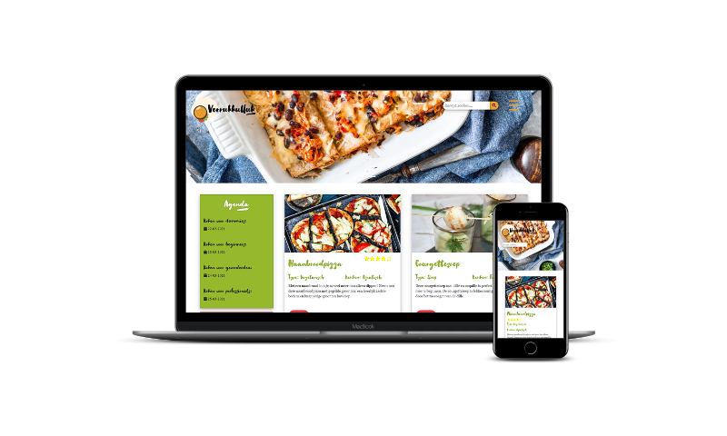
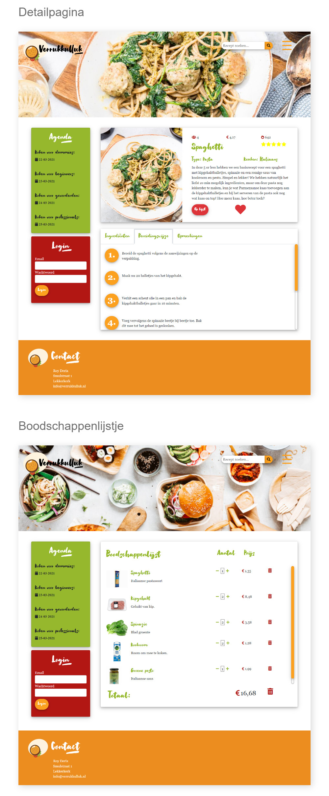
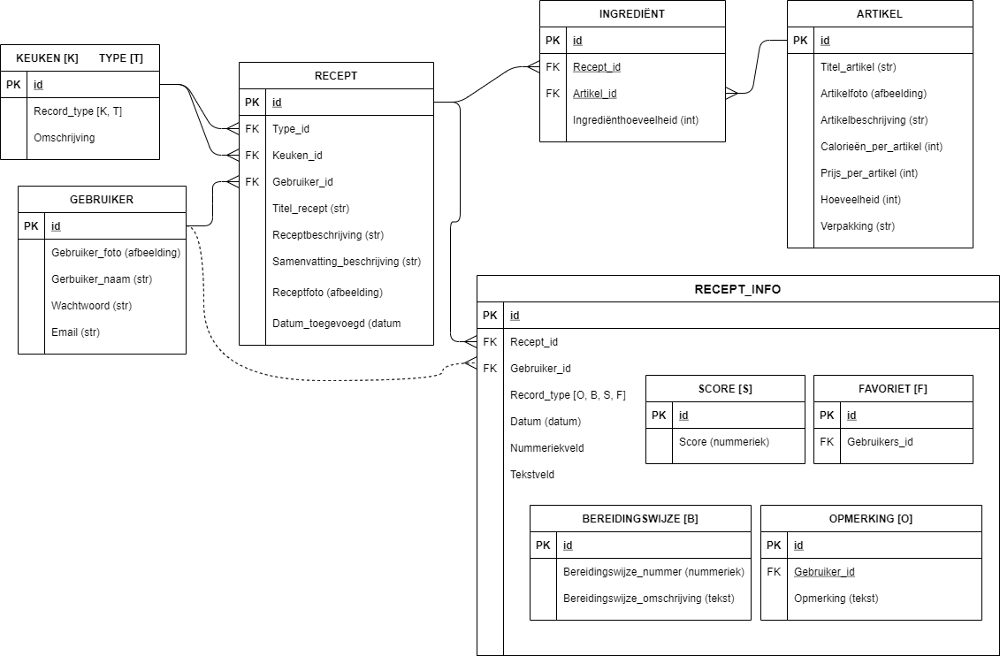
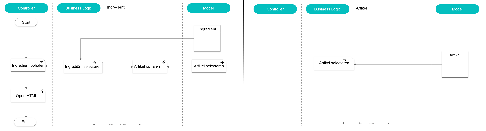

# Verrukkulluk!
Verrukkulluk is een receptenwebsite. Gebruikers kunnen deze recepten bekijken, inclusief de bereidingswijze en de ingrediënten. Daarnaast kunnen ze een waardering geven aan de hand van een aantal sterren, een recept op hun lijst van favorieten zetten, en een boodschappenlijstje maken. Dit boodschappenlijstje is "slim"; wanneer meerdere recepten gebruik maken van dezelfde ingrediënten, worden deze samengevoegd en berekend naar het meest kostenefficiënte aantal. Ook kunnen hier handmatig artikelen worden toegevoegd of verwijderd.

## Technologieën

De back-end applicatie heb ik geschreven in PHP, met behulp van een MySQL database.  
De front-end applicatie heb ik geschreven in HTML en CSS met behulp van template engine TWIG.

De volgende techologieën heb ik gebruikt:

- PHP / JavaScript / jQuery
- HTML / CSS
- Twig
- MySQL
- Restful API (POST/GET/DELETE)
- Bootstrap
- JSON
- Apache

## Methoden & Technieken

### Entity Relationship Diagram

### Application Structure Diagram / Functionele Decompositie

Dit voorbeeld toont het proces voor het ophalen van ingrediënten.

